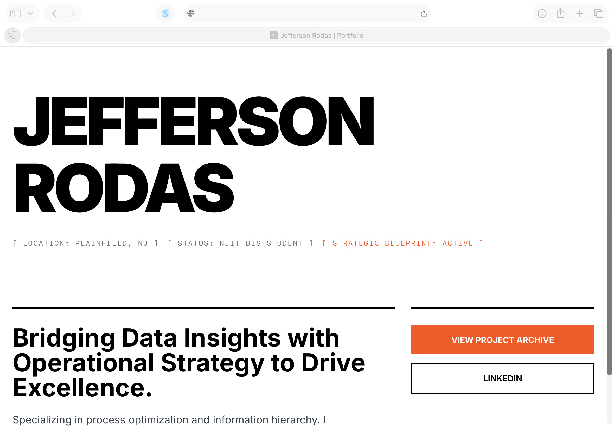

# Sprint 1 
### **Goal**: Establish the "Swiss shell" and Typographic Header. 
### **Tasks**: Initialize @index.html with Tailwind CSS. 
    - Implement a 12-colum grid and massive typography for "Jefferson Rodas" 
    - Verify responsivenss across Mac and IPad

### **Status**: Completed 
### **Verification**: Site Succesfuly renders with high-impact typography and is pushed to the main branch. 

