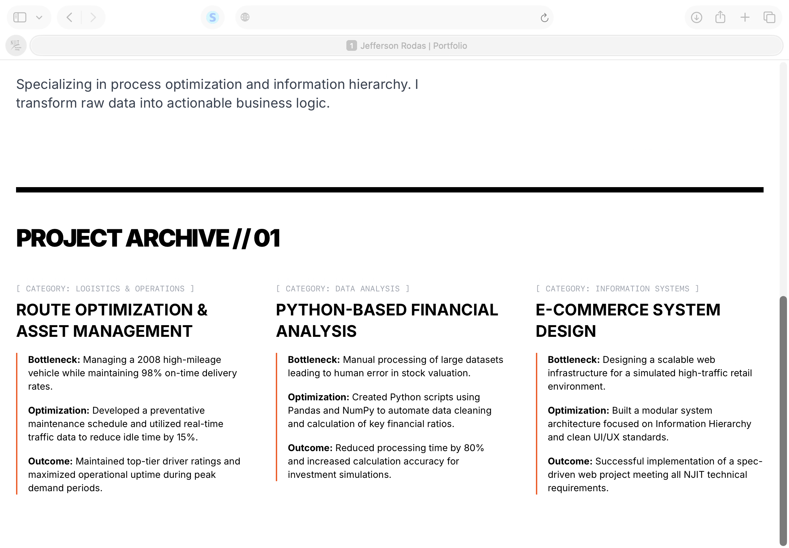
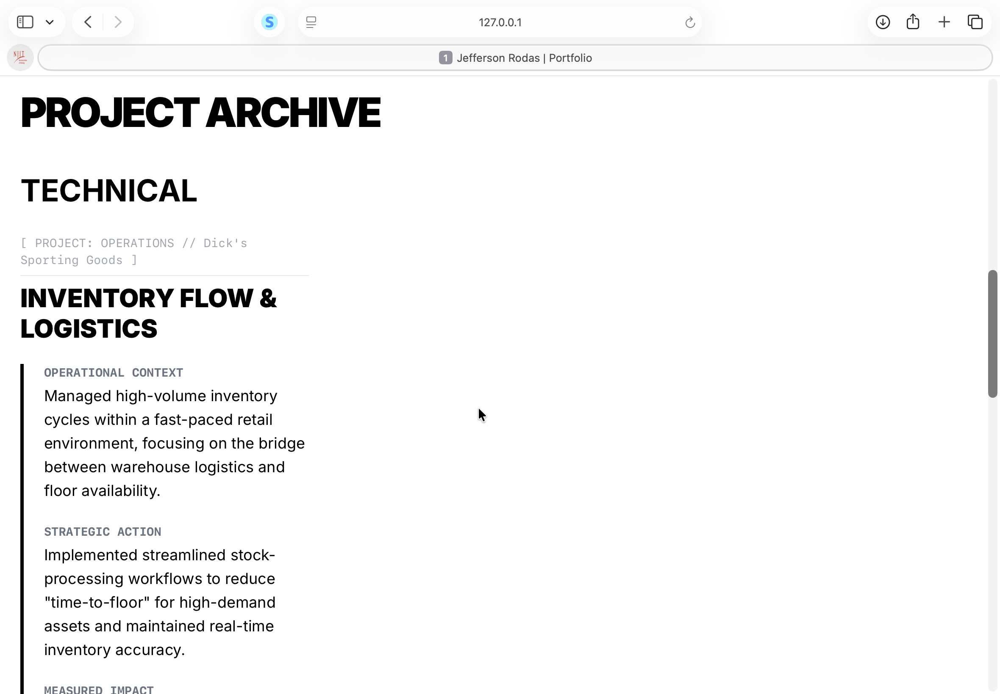

# Sprint 2
**Goal**: Create a structured grip for projects using the "Receipt" ledger
**Tasks**:
    - Add a "project archive" section below the Hero. 
    - Implement the 3-category layout: Technical, Professional experience, and Academic
    - Use the Bottleneck -- Optimzation and -- Outcome 
    - Layout is responsive(1 column on mobile, 3 columns on desktop.)
    - Atleast one project contains a "Process Receipt" link. 
**Refinement** 
    -Compare the current #file:index.html against #file:spec.md Does the typography meet the massive requirement? Is the 12 -column grid respected? Are there any non-goals being violated? What are the top 5 things we can do the improve the current version?

 

**Feedback** 
    - **Typography**: Supporting text sucha as, project titles and metadata can be made more prominent to align with the typography requirement. 
    - **12-column grid**:Good
    -**Non-goals**:Good
    -**5 improvements**
        -Consistency,increase the font size for project titles
        -Add process Receipts like links to code, pictures or documents
        - Improve white spaces'
        -Add navigation links 
        -  Ensure the project archive is clearly categorized into Technical, Professional Experience, and Academic sections as specified.

**Final Changes** 
    - Decided to implement the increase in font size, links to documentation, improvement in white spaces, and navigations links. I asked copilot to fix it impementing the top 5 improvements. There was definetly a lot of fixing in that version, such as: making sure that my categories were correctly separated. Also, ensuring that something like my Dick's sporting goods did not have a 'code' link if it didnt need one. I also decided to not leave to much white spaces. 

**Status**: Completed
**Verification**: Succesfully added a structured frip for projects using the ledger format. 